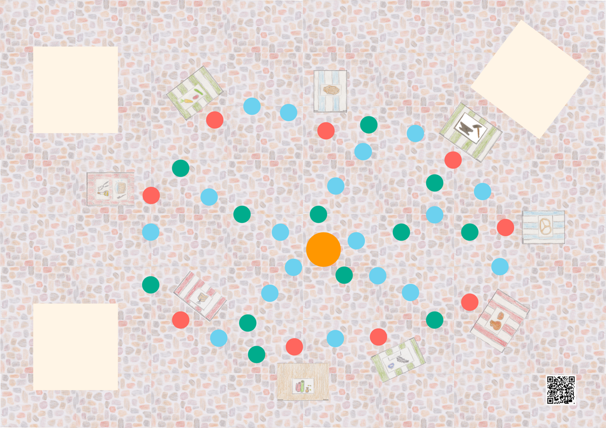

# Beispiel Spielplan
Auf dieser Seite findet ihr zwei Spielpläne: Spielplan * und Spielplan **. 
Diese zeigen euch, wo ihr die einzelnen Marktstände platzieren müsst. Da alle unterschiedliche Größen haben, haben sie einen bestimmten Platz.

### Spielplan *

### Spielplan **

