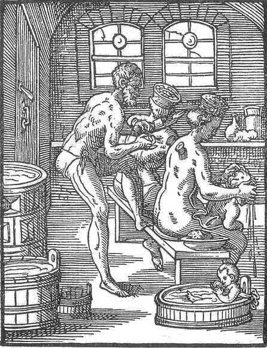

<audio controls="controls">
  <source src="assets/bader-low.mp3" type="audio/mpeg">
  Dein Browser unterstützt kein <code>audio</code> element.
</audio>

## Bader

Die Bader betrieben die Badehäuser des Mittelalters. Familien, die in ihren Häusern nicht die Möglichkeit hatten zu baden, besuchten alle ein bis zwei Wochen ein Badehaus.
Im Spätmittelalter ermöglichte das Baden in Badehäusern Geselligkeit und Abwechslung vom Alltag. Es gab keine Geschlechtertrennung. Die Gäste wurden mit Speisen und Getränken versorgt.

Die Bader boten oft zusätzliche Dienstleistungen an, wie das Schneiden von Haaren und Nägeln oder aber auch Wundbehandlungen. Sie waren also auch medizinisch tätig.
Badeknechte halfen bei medizinischen Tätigkeiten während Bademägde die Gäste bedienten.

In Badehäusern bestand häufig die Gefahr, sich mit Krankheiten anzustecken. 

Die Badestuben waren aufgrund hoher Brandgefahr aus Stein und befanden sich am Markt.

Auf dem Bild sieht man einen Bader, der seinen Gast mit Hilfe von Schröpfbechern medizinisch behandelt.

"der Bader", Stich von Jost Amman,aus "Das Ständebuch. Herscher, Handwerker und Künstler des Mittelalters", 1568
###### Bildquelle: https://commons.wikimedia.org/wiki/File:Bader.jpg,gesehen am 01.03.2018 um 16:46 Uhr

