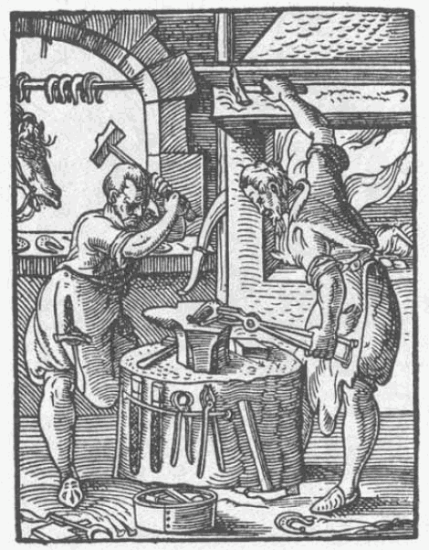

<audio controls="controls">
  <source src="assets/Schmied-low.mp3" type="audio/mpeg">
  Dein Browser unterstützt kein <code>audio</code> element.
</audio>

## Der Schmied

Im Mittelalter gab es viele verschiedene Schmiede. 

Der Kleinschmied (auch Schlosser) genannt, stellte verschiedene Schlösser her.

Gold- und Silberschmiede bearbeiteten ihre Edelmetalle für Schmuck, kirchliche Gegenstände und Tafelgeschirr. Vor allem Goldschmiede waren im Spätmittelalter angesehene Handwerker. Sie besaßen eigene Häuser und hatten oft einen Vertreter im städtischen Rat. (Der Rat legte Gesetze fest. Er bestand aus Vertretern der Oberschicht).

Kupferschmiede stellten verschiedene Waren her: Becher, Besteck, Geschirr und anderes.

Im Spätmittelalter gab es auch Waffenschmiede, die Waffen herstellten sowie Hufschmiede. Diese waren jedoch hauptsächlich auf dem Land vertreten.

Darstellung eines mittelalterlichen Schmieds, von Jost Amman, Frankfurt a.M, 1568

###### Bildquelle: hhttps://commons.wikimedia.org/wiki/File:Schmidt-1568.png, gesehen am 17.03.2018 um 17:18 Uhr

