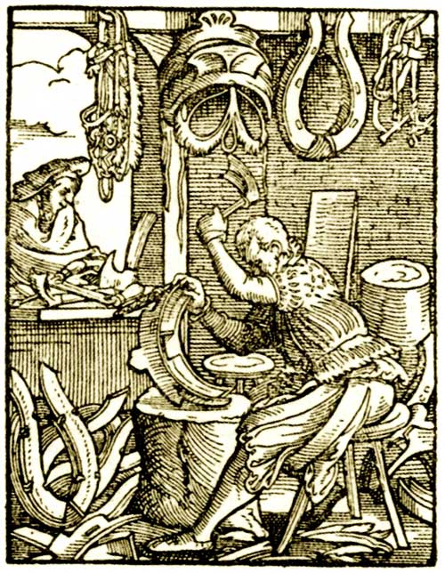

<audio controls="controls">
  <source src="assets/sattler-low.mp3" type="audio/mpeg">
  Dein Browser unterstützt kein <code>audio</code> element.
</audio>

## Der Sattler

Um ihren Beruf auszuführen, benötigten die Sattler Leder, welches sie von Gerbern beziehen konnten. Mit Hilfe des Leders stellte der Sattler dann Sättel und Geschirr zum Anspannen von Pferden her.
Sattel und Geschirr mussten den Pferden genau angepasst werden, damit keine Druckstellen an den Tierkörpern entstanden. Deswegen war der Beruf sehr aufwendig.

Zum Arbeiten nutzten die Sattler verschiedene Schneid- und Nähwerkzeuge. Mit einer Sattelzange wurde das Leder eingespannt, sodass der Sattler beide Hände zum Arbeiten frei hatte.

Hauptsächlich arbeiteten Sattler in der Stadt, doch gingen sie auch auf die Stör. Das bedeutet, sie zogen mit ihrem Werkzeug über das Land und von Kunde zu Kunde und erledigten dort ihre Arbeit. 

Auf dem Bild ist ein Sattler dargestellt, welcher ein Kummet herstellt. Kummets werden den Pferden um den Hals gelegt, um dort das Geschirr zu befestigen.

"Der Sattler", Holzschnitt von Jost Amman, 1568
###### Bildquelle: http://genwiki.genealogy.net/Datei:Sattler.jpg

